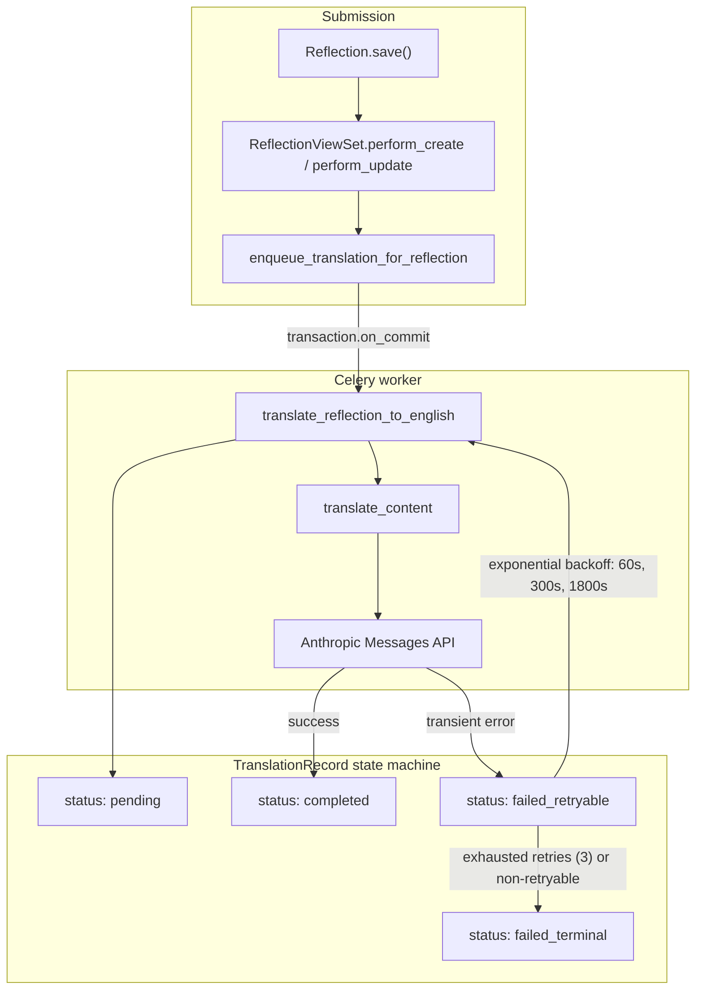

# Internationalization developer reference

Step 7_5 wired three i18n primitives into the platform. This document is the
developer-facing complement to the canonical product spec at
[`docs/user_stories/00_cross_cutting/i18n.md`](../../../docs/user_stories/00_cross_cutting/i18n.md).
The product spec describes _what_ the system does for users; this document
describes _how_ to find / extend / replace the implementation.

## The three layers

| Layer             | Where it lives                                | Tier 1 scope                        |
| ----------------- | --------------------------------------------- | ----------------------------------- |
| Content language  | `Reflection.language`, `Note.language` fields | `en`, `es`, `he`                    |
| UI translation    | `frontend/src/locales/<lang>/<ns>.json`       | `en`, `es` (full); `he` falls back  |
| Auto-translation  | `bunk_logs.core.translation.*` (Celery)       | English target only; Anthropic LLM  |

These three concerns are intentionally distinct. Mixing them (e.g. relying
on auto-translation to populate UI strings) breaks the latency / cost /
review-flow assumptions of each layer.

## Module map

The `bunk_logs.core.translation` package is a thin, swappable surface:

| Module       | Responsibility                                                                                          |
| ------------ | ------------------------------------------------------------------------------------------------------- |
| `client.py`  | Synchronous Anthropic call. Pure function, no Django models, easy to mock or replace.                   |
| `tasks.py`   | Celery tasks + the `enqueue_translation_for_reflection` helper. Owns the `TranslationRecord` lifecycle. |
| `metrics.py` | Datadog statsd adapter. No-ops cleanly when `datadog` isn't installed.                                  |
| `beat.py`    | Idempotent `register_periodic_tasks(apps)` for the nightly GC schedule. Called from migration 0027.    |

To swap the translation provider (e.g. move off Anthropic), replace
`client.py` only. `TRANSLATION_PROMPT` lives at module scope so the new
provider can match it byte-for-byte if desired.

To move metrics from Datadog to Prometheus, replace `metrics.py`. The
public surface (`record_submitted`, `record_completed`, `record_failed`)
is the only thing call sites import.

## Lifecycle



Re-translation on edit flows through the same path: `perform_update`
calls `enqueue_translation_for_reflection`, which revokes any pending
Celery task before queueing a fresh one. Prior `TranslationRecord` rows
stay around for the 90-day retention window so audits can see what was
shown to readers before the edit.

## Settings

All translation-pipeline knobs live in `config.settings.base` and are
overridable via env vars in any environment.

| Setting                                     | Default              | What it controls                                                               |
| ------------------------------------------- | -------------------- | ------------------------------------------------------------------------------ |
| `ANTHROPIC_API_KEY`                         | `""`                 | Anthropic credential. Empty value means `translate_content` raises terminal.   |
| `ANTHROPIC_TRANSLATION_MODEL`               | `"claude-sonnet-4-5"`| Model id passed to `client.messages.create`.                                   |
| `TRANSLATION_TASK_SOFT_TIME_LIMIT_SECONDS`  | `30`                 | Celery soft time limit per task; hard limit is `+30`.                          |
| `TRANSLATION_TASK_MAX_RETRIES`              | `3`                  | Attempts before flipping to `failed_terminal`. Matches the product spec.       |
| `TRANSLATION_RETENTION_DAYS`                | `90`                 | Age threshold for `purge_expired_translations`.                                |

`ANTHROPIC_API_KEY` is set via the Render dashboard in production /
previews. Local dev can run without it: `translate_content` returns a
non-retryable `TranslationFailureError` so the task short-circuits to
`failed_terminal` rather than spinning.

## Datadog metrics

Constants in `metrics.py`; tag keys are `content_type`, `source_language`,
`target_language` (and `reason` + `terminal` for failures).

| Metric                              | Type         | Notes                                                                |
| ----------------------------------- | ------------ | -------------------------------------------------------------------- |
| `bunklogs.translation.submitted`    | counter      | Incremented when the Celery task starts.                             |
| `bunklogs.translation.completed`    | counter      | Incremented on `status: completed`.                                  |
| `bunklogs.translation.failed`       | counter      | Tagged `terminal:true|false` so retryable failures are visible.      |
| `bunklogs.translation.tokens_used`  | distribution | Anthropic `input_tokens + output_tokens`, emitted on completion.     |

When `datadog` isn't installed (CI default), all four emit a debug log
and no-op. Production workers have `dd-trace` configured so the metrics
land in the existing Datadog tenant.

## API surface

### `GET /api/v1/me/preferences/`

Returns the current user's `Person.preferred_language` and
`Person.translation_preference`. 404 if the user has no Person row
(orphan account); callers fall back to localStorage-only behaviour.

### `PATCH /api/v1/me/preferences/`

Partial update of the two reader-controlled fields above. The serializer
is a strict whitelist -- unrelated `Person` columns (`first_name`,
`email`, ...) silently fall off the request.

### `POST /api/v1/reflections/<id>/retry-translation/`

Story 44's manual retry hook. Gated on the current `TranslationRecord`
status: only `failed_retryable` or `failed_terminal` rows are allowed
through; otherwise responds 409. Resets `attempt_count` so the fresh
task gets the full three-attempt budget. English reflections respond
400 ("no translation needed").

### Translation embed on `GET /api/v1/reflections/<id>/`

`ReflectionSerializer.translation` returns `None` for English content
and a dict shaped for the `TranslationDisplay` component otherwise:

```json
{
  "id": "<uuid>",
  "status": "pending | completed | failed_retryable | failed_terminal",
  "source_language": "es",
  "target_language": "en",
  "translated_text": "...",
  "model_id": "claude-sonnet-4-5",
  "updated_at": "2026-05-20T12:34:56+00:00",
  "attempt_count": 1
}
```

## Frontend conventions

Locale files live under `frontend/src/locales/<lang>/<namespace>.json`,
keyed by IETF language tag (`en`, `es`, `he`).

### Namespace policy

| Namespace             | Owner step          | Purpose                                       |
| --------------------- | ------------------- | --------------------------------------------- |
| `common`              | 7_5 (this step)     | Shared chrome: language picker, translation display, validation, buttons. |
| `kitchen_staff`       | 7_11                | Kitchen Staff dashboard + reflection form (Story 37).                     |
| `audience_disclosure` | 7_6 / 7_7 onward    | Privacy chip + audience copy used by every role's form.                   |

New namespaces are added by:

1. Registering them in [`frontend/src/i18n/index.js`](../../../frontend/src/i18n/index.js) under
   `DEFAULT_NAMESPACES` and `resources`.
2. Creating the three JSON files (`en/<ns>.json`, `es/<ns>.json`,
   `he/<ns>.json`) at the same time, even if Hebrew is just `{}`.
3. Running `npm run lint:i18n` locally to confirm Spanish key parity.

### Hebrew handling

Hebrew UI is Tier 2 (June 5 deadline can't absorb a full RTL pass).
`react-i18next` is configured with `fallbackLng: 'en'`, so any key
missing from a Hebrew namespace renders the English string instead.
Hebrew _content_ is still first-class: `TranslationDisplay` sets
`dir="rtl"` on the original block when `sourceLanguage === 'he'`.

### Lint guardrails

`npm run lint:i18n` does two things:

1. Runs `frontend/scripts/check-i18n-key-parity.mjs` to warn on any key
   present in `en/<ns>.json` but missing from `es/<ns>.json`. Hebrew is
   intentionally exempt because the fallback covers it.
2. Runs `eslint-plugin-i18next`'s `no-literal-string` rule (graded
   `warn`) against the i18n primary surfaces (`LanguagePicker.jsx`,
   `TranslationDisplay.jsx`, `AudienceDisclosure.jsx`) to flag any
   hardcoded JSX strings sneaking in.

Both are warning-only for now. Future steps (7_6+) will add their own
component paths to the eslint argv as their files reach full
localization, and the script can graduate to a `src/**/*.{jsx,tsx}`
glob once the codebase is uniformly clean.

## Adding a new translatable content type

The current pipeline is reflection-shaped, but extending to `Note` (or
any future model) is mechanical:

1. Add `<model>.language` with the `Reflection.LANGUAGES` choices.
2. In `tasks.py`, add a sibling task `translate_<model>_to_english`
   that loads the row, flattens its text into a single string, and
   calls `translate_content` exactly like the reflection task does.
   Use the same `RETRY_BACKOFF_SECONDS` constant.
3. Add a matching `enqueue_translation_for_<model>` helper that wires
   `transaction.on_commit` and revocation for re-translation on edit.
4. Pick a stable `content_type` string (e.g. `"note"`) and use
   `TranslationRecord.latest_for(content_type, model_id)` so the GC
   task and frontend embed code keep working unchanged.
5. Surface the translation embed on the serializer using the same
   shape as `ReflectionSerializer.get_translation`.

Note auto-translation is currently deferred to Steps 7_8 / 7_9 / 7_10
(see migration 0026's docstring).

## Operational notes

* The nightly GC runs at 03:15 server time (`bunk_logs.core.translation.beat`).
  Production Beat is the `django-celery-beat` `DatabaseScheduler`, so the
  schedule is a `PeriodicTask` row created by migration 0027. To change
  the cadence: edit `beat.py`, write a follow-up data migration that
  updates the row in place (don't edit the schedule manually in admin --
  the next deploy that re-runs the registration will overwrite it).
* `ANTHROPIC_API_KEY` is per-environment (production + each preview).
  Render's preview-env feature inherits parent env vars by default, so
  preview deploys translate against the production Anthropic tenant.
  Anthropic usage on previews is small (preview QA only) but worth
  monitoring once non-English content lands.
* `make sync-prod-db` will pull production `TranslationRecord` rows into
  local dev unchanged; they're harmless because the local Celery worker
  is gated on `ANTHROPIC_API_KEY` and will short-circuit to
  `failed_terminal` if the key is unset.
