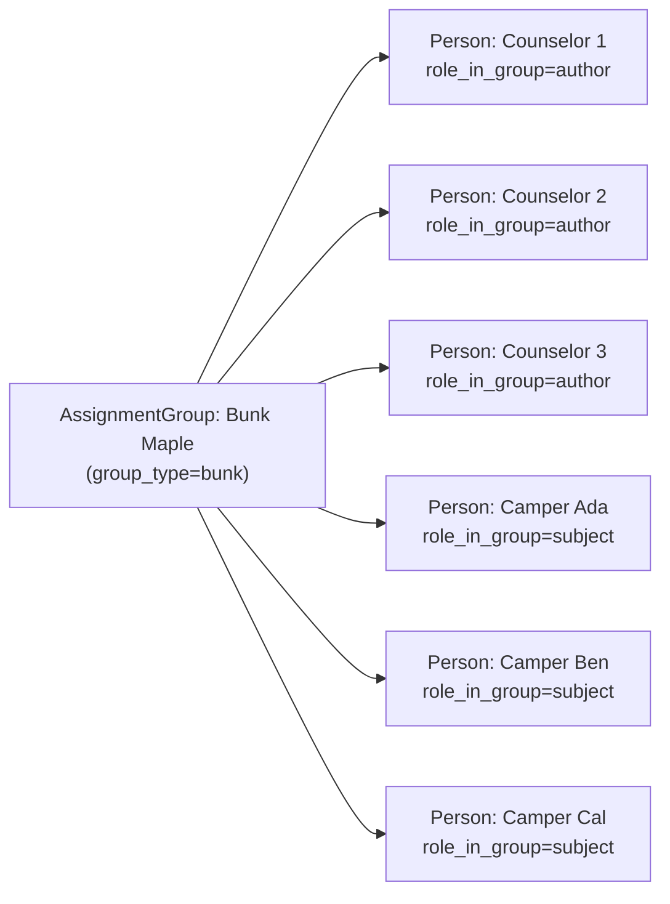
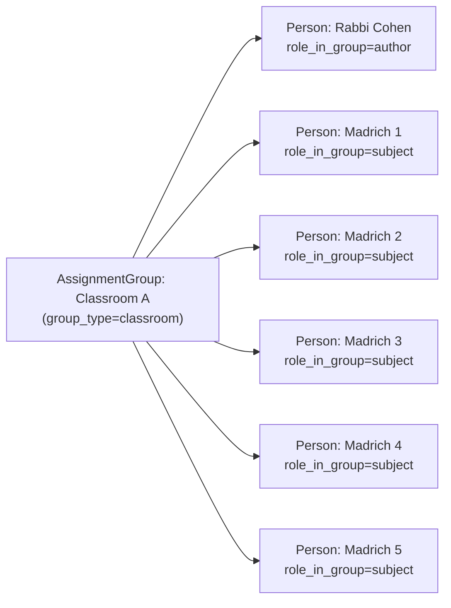
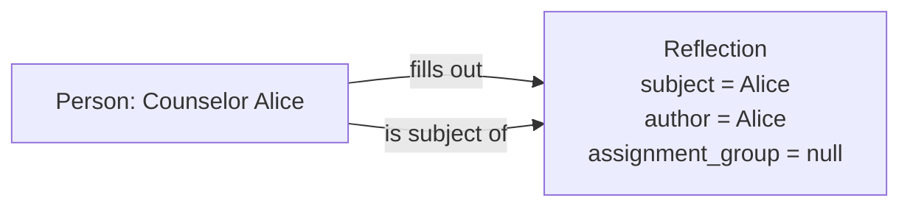

# BunkLogs Data Model

## Core Multi-Tenant Hierarchy

```
Organization
  └── Program (summer_camp | religious_school)
        └── Membership  (Person ↔ Program with a role)
        └── AssignmentGroup  (bunk, unit, caseload, etc.)
              └── AssignmentGroupMembership  (Person ↔ Group as subject or author)
```

## Assignment Groups and the Subject/Author Pattern

### Background

The original data model assumed a simple self-reflection: a counselor fills out a form about
themselves. The bunk log use case breaks this: a **counselor fills out a form ABOUT a camper**.
Multiple counselors share responsibility for a roster, and "complete" means every camper got
a log from someone.

This generalized pattern is called **shared-roster observation** and is captured with three
models: `AssignmentGroup`, `AssignmentGroupMembership`, and new fields on `Reflection`.

### AssignmentGroup

An `AssignmentGroup` represents any collection of people that share a reflection context.

| field | description |
|---|---|
| `organization` | FK to Organization |
| `program` | FK to Program |
| `name` | Human-readable name ("Bunk Maple") |
| `slug` | URL-safe identifier, unique per program |
| `group_type` | `bunk`, `classroom`, `caseload`, `unit`, `division`, `cohort`, `specialty`, `custom` |
| `parent` | FK to self — allows nesting (bunk → unit → division) |
| `is_active` | Soft-delete flag |

Nested example:

```
Division: Senior Division
  └── Unit: Gefen
        ├── Bunk: Maple
        └── Bunk: Oak
  └── Unit: Tzofim
        ├── Bunk: Cedar
        └── Bunk: Birch
```

### AssignmentGroupMembership

Links a `Person` to a `Group` with a role: `subject` or `author`.

- A **subject** is who the reflection is ABOUT (e.g. a camper).
- An **author** is who FILLS OUT the reflection (e.g. a counselor).

A person may hold both roles in the same group (unique_together allows it — intentional for
peer-mentoring and faculty-as-Madrich scenarios).

### ReflectionTemplate: subject_mode and assignment_scope

New fields on `ReflectionTemplate` declare how a template is filled out:

| field | values | meaning |
|---|---|---|
| `subject_mode` | `self` | Author == Subject (classic self-reflection) |
| | `single_subject` | Counselor writes about one camper per submission |
| | `multi_subject` | One submission covers multiple campers |
| | `group` | Reflection is about a whole group, no individual subject |
| `assignment_scope` | `none` | No group context |
| | `per_subject_in_group` | One reflection per subject in the assignment group |
| | `per_group` | One reflection per group as a whole |
| `assignment_group_types` | e.g. `["bunk"]` | Which group types this template applies to |
| `author_role_filter` | e.g. `["counselor"]` | Roles eligible to author |
| `subject_role_filter` | e.g. `["camper"]` | Roles eligible to be subjects |
| `required_per_subject_per_period` | integer | How many reflections per subject per period for completion |
| `subject_visible` | bool | Whether subjects can see reflections about themselves |

**Coherence rules** (enforced by `validate_template_coherence`):
- `subject_mode=self` → `assignment_scope=none`
- `subject_mode=group` → `assignment_scope=per_group`
- `subject_mode=single_subject|multi_subject` → `assignment_scope=per_subject_in_group`
- When `assignment_scope != none` → `assignment_group_types` must be non-empty
- `subject_visible=True` is only valid when `subject_mode != self`

### Reflection: subject, author, assignment_group, submission_id

| field | description |
|---|---|
| `subject` | FK to Person — who the reflection is ABOUT (null for group-mode) |
| `subject_group` | FK to AssignmentGroup — set when `subject_mode=group` |
| `author` | FK to Person — who FILLED OUT the reflection |
| `assignment_group` | FK to AssignmentGroup — which group context (e.g. "Bunk Maple") |
| `submission_id` | UUID — groups multi-subject reflections from one submit event |
| `submitted_by` | FK to User — audit trail (may differ from author's linked User) |

---

## Example Scenarios

### Bunk Maple — Counselor Bunk Log (daily bunk log)



**Template config:**
- `subject_mode = single_subject`
- `assignment_scope = per_subject_in_group`
- `assignment_group_types = ["bunk"]`
- `author_role_filter = ["counselor"]`
- `subject_role_filter = ["camper"]`

**Each day, 8 Reflections are created** (one per camper), each with:
- `subject` = individual camper
- `author` = the counselor who wrote it
- `assignment_group` = Bunk Maple
- `submission_id` = shared UUID for all 8 if submitted in one batch

### TBE Classroom — Faculty Observes Madrichim



**Template config:**
- `subject_mode = single_subject`
- `assignment_scope = per_subject_in_group`
- `author_role_filter = ["faculty"]`
- `subject_role_filter = ["madrich"]`
- `subject_visible = True`

**Each observation cycle** produces 5 Reflections (one per Madrich), each authored by the
faculty member.

### Self-Reflection (existing: counselor weekly, TBE Madrachim self-reflection)



**Template config:**
- `subject_mode = self`
- `assignment_scope = none`
- `subject_visible = True` (self always visible)

All existing reflections default to this mode. Migration populates `author = subject` for
all pre-existing rows.

---

## submission_id

`submission_id` is a UUID that groups reflections created in a single submit event.

- **Single self-reflection**: one unique `submission_id`.
- **Batch (e.g. counselor logs all 8 campers at once)**: all 8 Reflections share one `submission_id`.

This allows the API and UI to group submissions and detect partial batches.

---

## API Endpoints (as of step 3.17)

| endpoint | description |
|---|---|
| `GET /api/v1/assignment-groups/` | List groups visible to current user |
| `GET /api/v1/assignment-groups/{id}/` | Detail with memberships |
| `GET /api/v1/assignment-groups/{id}/subjects/` | Persons in subject role |
| `GET /api/v1/assignment-groups/{id}/authors/` | Persons in author role |
| `GET /api/v1/reflections/` | List reflections (now includes `?subject=`, `?author=`, `?assignment_group=`) |

---

## TemplateAssignment (as of Step 7_20)

`TemplateAssignment` binds a published `ReflectionTemplate` to a target audience for a date window. As of Step 7_20 it supports four `target_type` values: `role`, `individuals`, `tag_group`, and `assignment_group`. The last type resolves dynamically to `Membership` rows whose role is in `template.author_role_filter` AND who hold an active `AssignmentGroupMembership` with `role_in_group='author'` in the specified group.

Two new control fields were added:
- `is_required` (bool, default `True`): when `False` the assignment lands in the role's optional forms library and does not affect the dashboard "all set" state (decision FA5).
- `title` (str, blank): per-assignment display label; falls back to `template.name` via the read-only `display_title` field on the API response.

The assignments endpoints (`/api/v1/leadership-team/assignments/`) now accept both `program_lead` and `admin` capabilities (decision FA7). See `docs/design/form_orchestration_reframe.md` §3 for design rationale.

---

## Template resolution after Step 7_21

Per-role dashboards used to query `ReflectionTemplate` directly with hard-coded filters (one per role flow). After Step 7_21 they all delegate to a single resolver in `bunk_logs.core.assignment_resolution`:

- `resolve_template_for(*, organization, program, as_of, role, subject_mode, cadence=None, assignment_group=None, viewer=None)` returns the active `ReflectionTemplate` for a `(role, subject_mode)` tuple, or `None` when no `TemplateAssignment` is active.

Key implications:

- **The Leadership Team controls which template each role sees.** Without an active `TemplateAssignment`, the dashboard renders the `no_template` empty state — no template, no tasks. This is the explicit contract the LT-driven form orchestration relies on (decision FA10).
- **Org-shadows-global ordering is preserved.** When multiple assignments match, the one whose template's `organization` equals the caller's org wins over a global (`organization IS NULL`) template, then a higher `template.version` breaks remaining ties.
- **`assignment_group` is preferred when supplied.** For per-bunk templates (e.g. counselor camper-reflection) the resolver prefers a group-specific assignment over a program-wide role assignment, so an LT can override one bunk's template without touching the rest of the program.
- **`cadence_override` wins over `template.cadence`.** When the LT pins a template to a different cadence on a per-assignment basis, the resolver matches against the override first.

Per-role `common.py` files (`api/<role>/common.py`) now contain thin wrappers that call `resolve_template_for` with the appropriate role/subject_mode/cadence shape. Adding a new role flow means writing one such wrapper and calling the same resolver — no per-role template query logic should ever land in dashboards again.

Companion helpers:
- `active_assignments_for(...)` — viewer-aware audience filter; the basis for "what tasks do I owe?" task derivation.
- `list_required_assignments_for(...)` / `list_optional_assignments_for(...)` — symmetry pair; the optional list seeds the Wave 2 "forms I can also fill out" library.
- `resolve_members(...)` — moved here from `api/leadership_team/assignments.py` so the LT assignments API and the per-role dashboards share one audience-resolution implementation. The legacy import path still works through a re-export.
